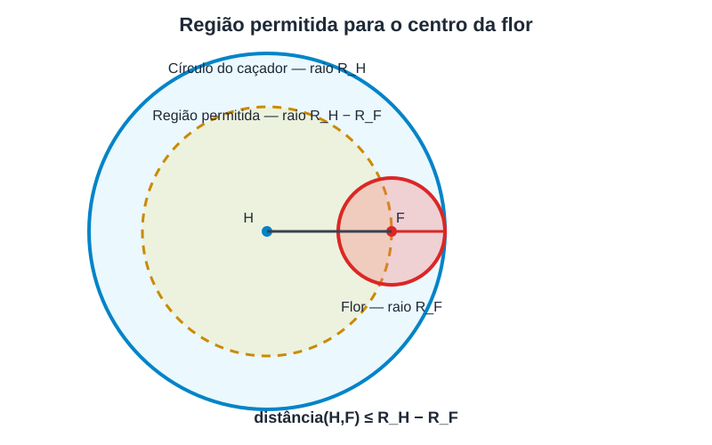

# 1039 - Fire Flowers

(Flores de Fogo)

## Resumo
Lê linhas com valores até EOF, em cada linha lê 6 valores inteiros, que representam o raio, X do centro e Y do centro, de duas circunferências (um feita pelo caçador e outra sendo a flor).
Após isso, verifica se a flor está completamente dentro círculo do caçador, se estiver exibe "VIVO", se não "MORTO".

---

**Abordagem:** 
 Lê linhas enquanto o resultado da leitura for diferente de null. Para cada linha, separa os seis valores com ``split`` e converte-os para números inteiros com ``Integer.parseInt``.

Considere:

$$
x_H,\ y_H,\ R_H
\quad \text{como o centro e o raio do círculo do caçador}
$$

$$
x_F,\ y_F,\ R_F
\quad \text{como o centro e o raio do círculo da flor}
$$

A equação utilizada para verificar a distância entre dois pontos é:

$$
d^2 = (x_F-x_H)^2+(y_F-y_H)^2
$$

Para que a flor esteja completamente dentro do círculo do caçador, o raio do caçador deve ser maior ou igual ao raio da flor, e a distância entre os centros deve ser menor ou igual à diferença entre os raios:

$$
R_H \geq R_F
$$

$$
(x_F-x_H)^2+(y_F-y_H)^2
\leq
(R_H-R_F)^2
$$

A comparação é realizada utilizando as distâncias ao quadrado, evitando a necessidade de calcular uma raiz quadrada.

  

> **Observação:** representação visual criada com auxílio de inteligência artificial para ilustrar a relação entre os círculos.

Caso as duas condições sejam satisfeitas, adiciona RICO ao StringBuilder; caso contrário, adiciona MORTO. Ao final, exibe os resultados de todos os casos.

---

⚫ **Categoria:** Geometria Computacional &nbsp; 

---

🔗 [Ver enunciado completo](https://judge.beecrowd.com/en/problems/view/1039)

